# 如何使用

## 服务器端

1. 下载源代码并将工作目录更改至源代码所在目录

   ```shell
   git clone https://github.com/InfoSLAB/Chatter-Server.git
   cd Chatter-Server
   ```

2. 使用`npm`下载依赖库

   ```shell
   npm install
   ```

3. 使用`webpack`将`client.js`打包至`bundle.js`

   ```shell
   webpack client.js public/js/bundle.js
   ```

4. 使用`node`运行`server.js`

   ```shell
   node server
   ```

## 客户端

### 访问

1. 在浏览器地址栏中输入`localhost:3000`

### 注册／登陆

浏览器弹出对话框，选择是否是新用户。点击确定即进入注册流程，点击取消则进入登陆流程。

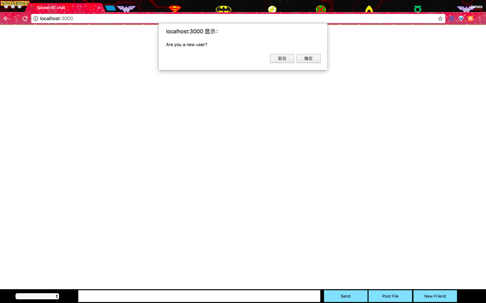

#### 注册

1. 输入用户名并点击确定

   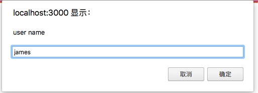

2. 输入电子邮箱地址并点击确定

   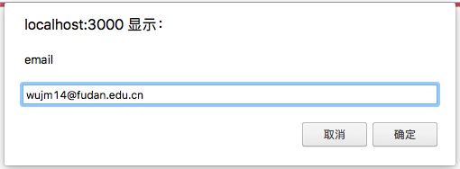

3. 登陆邮箱并获取验证码

   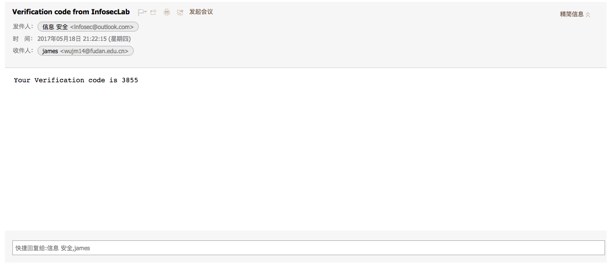

4. 在文本框中输入验证码并提交

   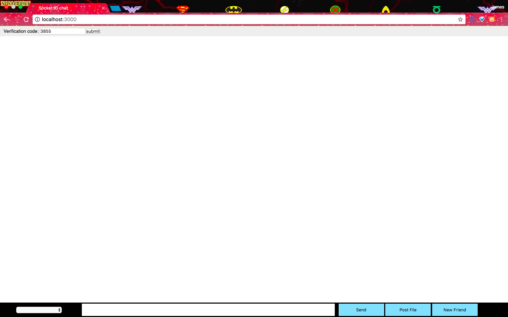

5. 登陆成功。请点击超链接下载并保存`priv_key.pem`以备之后的登陆操作。


注意：

- 若电子邮箱输入错误则无法获取验证码，则无法完成后续流程
- 若验证码输入错误，屏幕将显示'invalid code'，需重新注册
- 若用户名重复，屏幕将显示'false'，需重新注册

#### 登陆

1. 输入用户名并点击确定

   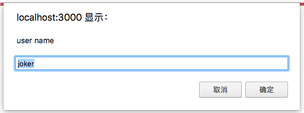

2. 输入密钥（注册时保存的`priv_key.pem`中的文本）并点击确定

   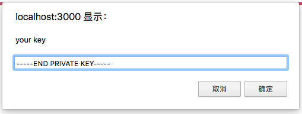

3. 登陆成功

注意：

- 密钥输入错误，控制台将输出错误信息，无法完成后续流程

### 添加好友

1. 点击添加好友按钮

   

2. 输入想要添加的好友昵称并点击确定

   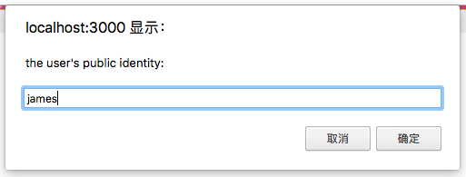

3. 对方可以接受或拒绝好友请求

   

   - 接受

     您将收到提示，同时好友列表得到更新。

     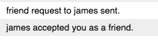

   - 拒绝

     您将收到提示。

     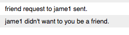

注意：

1. 若昵称输入错误，对方将不会受到好友请求。

#### 聊天

1. 在在线好友列表中选择一位好友，在文本框中输入文字，点击发送按钮即可发送。

   

2. 聊天双方皆可看到聊天内容。


#### 发送文件

1. 在在线好友列表中选择一位好友，点击发送文件按钮，选择一个文件。

   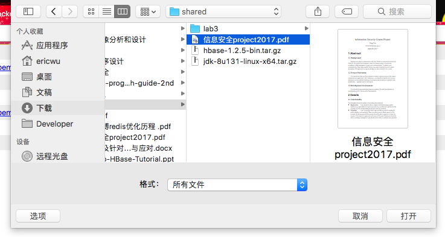

2. 对方即可看到该文件的超链接，点击即可下载。

